# **CRUD de usuarios con arquitectura hexagonal**

# Cómo Ejecutar el proyecto

# 1. Requisitos del programa

- versión del java : 17
- instalar intellij IDEA
- instalar JDK Java 17
- instalar el administrador de paquetes maven versión 3.9.9
- instalar postgresSQL

# 2. Para nuestra preferencia se utilizo el IDE intellij IDEA, importar el proyecto

# 3. Configurar base de datos postgresSQL

- Ir al **application.properties** y cambiar el usuario y la contraseña de acuerdo a la configuración de su base de datos postgresSQL

```properties
spring.datasource.username=postgres
spring.datasource.password=123456
```

# 4. Compilar la aplicación desde la clase llamada UserApplication

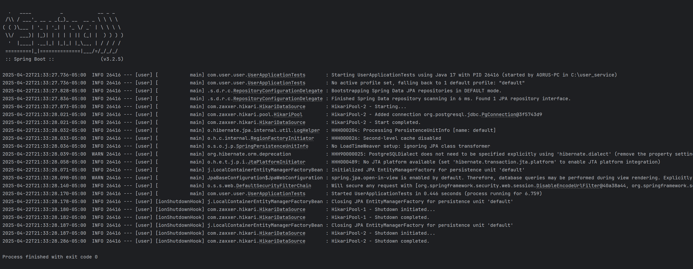

# 5. Para abrir la documentación **Swagger** digitar en el navegador la siguiente ruta

- http://localhost:8080/swagger-ui/index.html#/

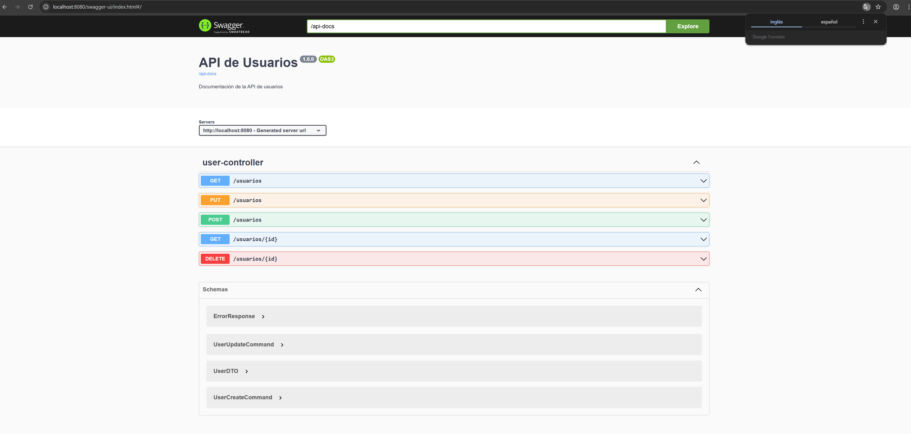

# 6. Implementación de la arquitectura hexagonal

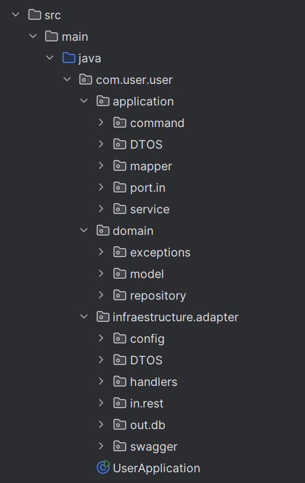

# Covertura de pruebas

# 7. Ejecutar las pruebas unitarias

- Seleccionar el proyecto con click derecho y pulsar la opción **run 'All test'**

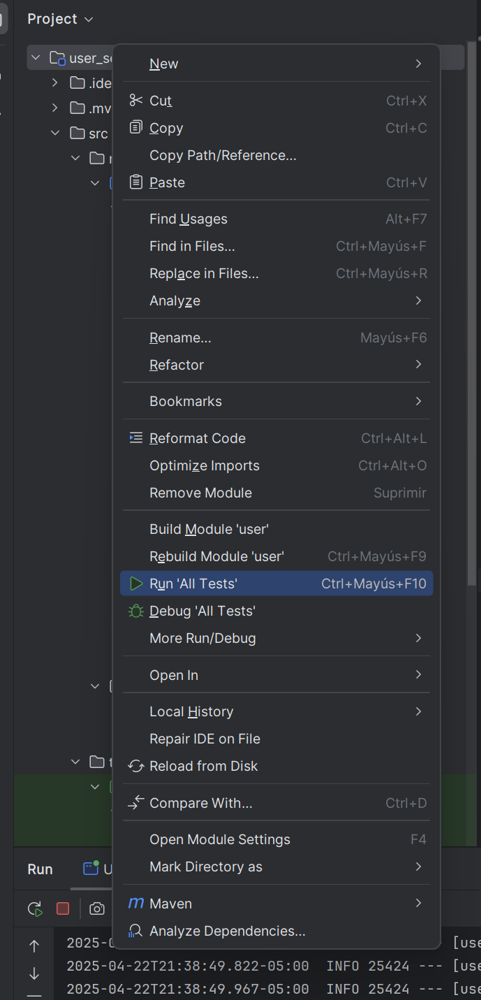

# 8. Generar el reporte JaCoCo

- ejecutar el siguiente comando: mvn clean verify

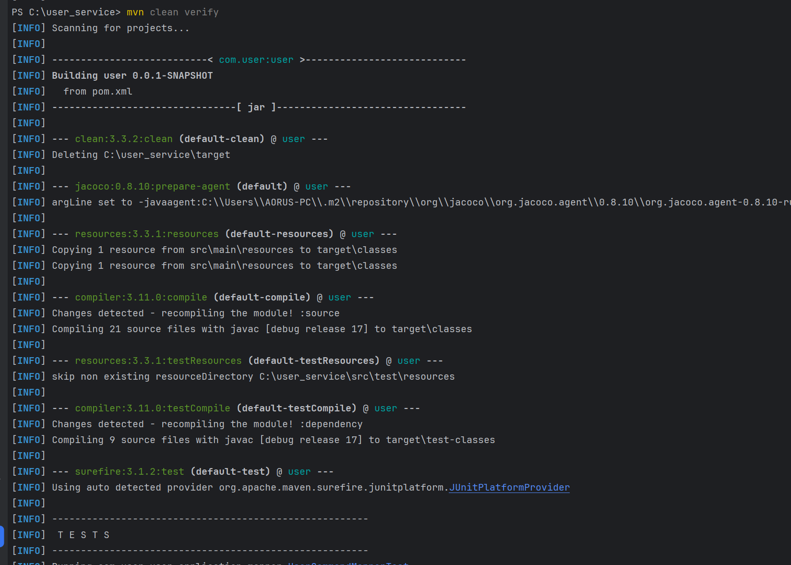

# 9. Cómo encontrar el reporte de JaCoCo

- ir a la carpeta target/site/index.html

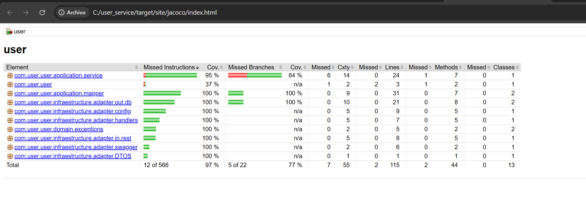

# 10. Cómo crear un usuario

- para crear un usuario solamente pide el username y el password y devuelve toda la información creada
- **Nota: el username debe ser único de lo contrario lanza error**

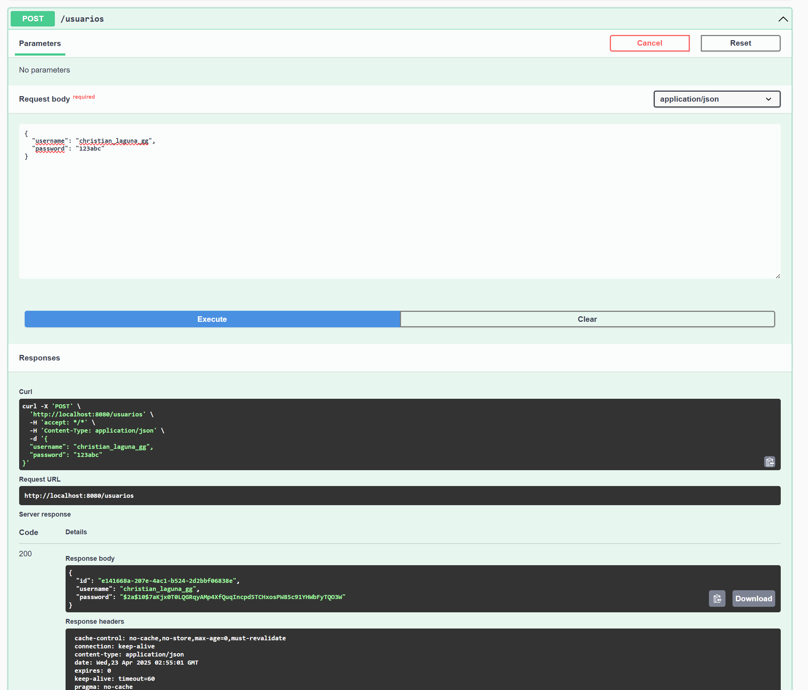

# 11. Cómo editar un usuario

- para editar un usuario pide el id, username y password
- **Nota: el username debe ser único y el id del usuario debe existir de lo contrario lanza error**

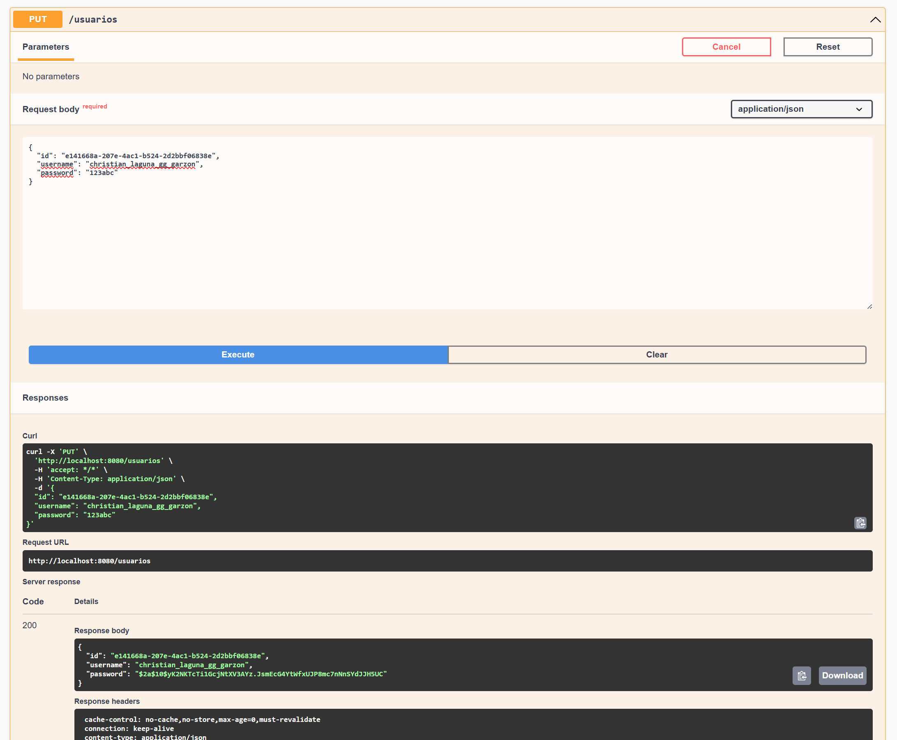

# 11. Cómo traer usuario por id

- esta consulta pide obligatoriamente un usuario con id que existe en base de datos
- **Nota: el id del usuario debe existir de lo contrario lanza error**

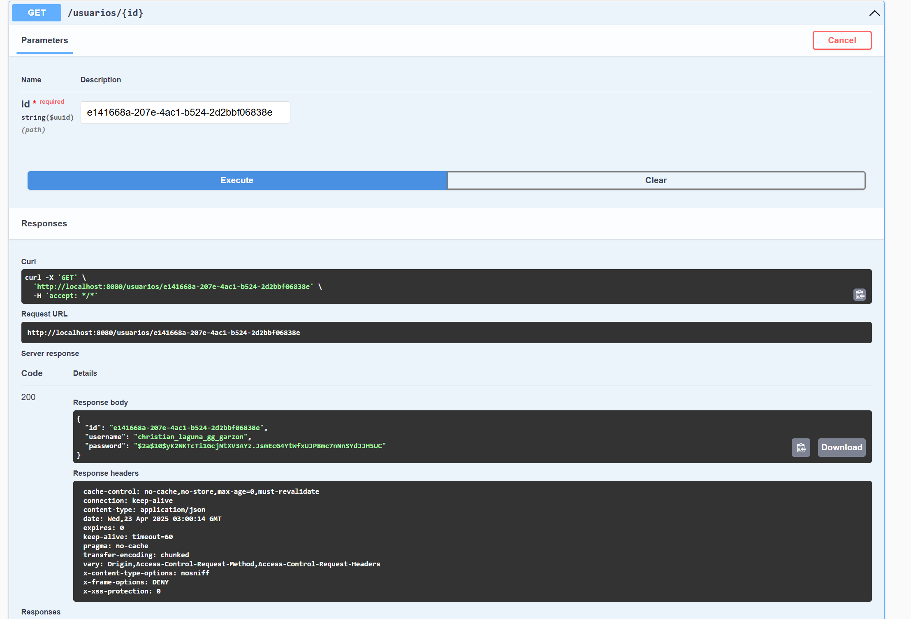

# 12. Cómo traer un listado de usuarios

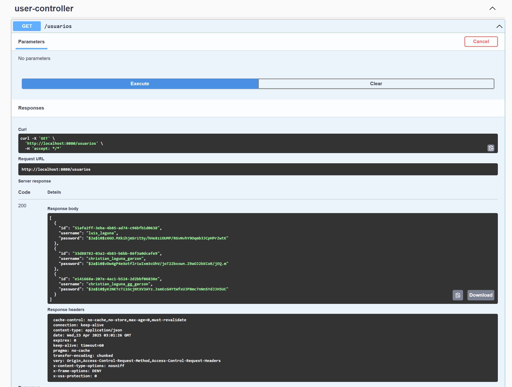

# 13. Cómo eliminar el usuario

- esta consulta pide obligatoriamente un usuario con id que existe en base de datos
- **Nota: el id del usuario debe existir de lo contrario lanza error**

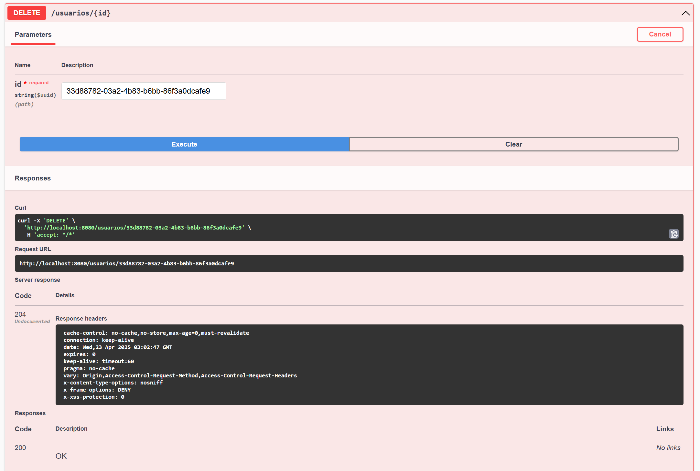

- listar usuarios otra vez, ya no debe éxistir el usuario que se ha eliminado

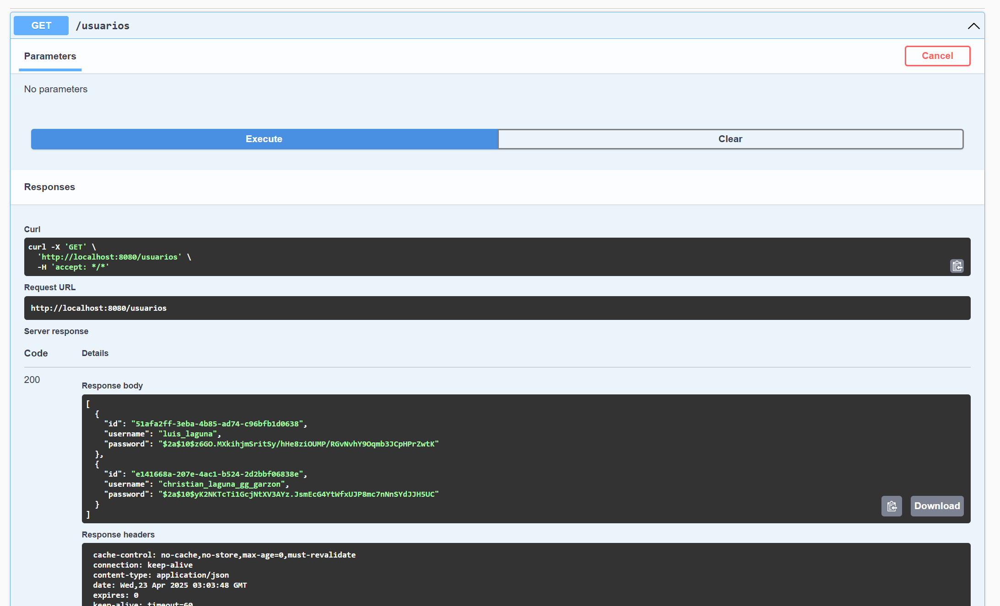

# 14. Analisis de Diseño del software

- Objetivo: el software gestiona todas las operaciones CRUD de la entidad de usuarios mediante un software que utiliza la arquitectura limpia con manejo de errores y pruebas unitarias

## 1. Construir la capa de dominio:

- se identificó los atributos que necesitaba la clase user que se comunica con la clase user entity
- se expone los métodos de la base de datos para realizar un CRUD mediante una interfaz llamada **IUserRepository**
- se crean algunas excepciones para utilizarlas a nivel de lógica en los casos de uso en el apartado de aplicación

## 2. Construir la capa de aplicación

- para no exponer directamente ni la clase de usuario entity y user se ha creado clases que validan los datos que escribe el usuario se denominan **Clases Commmand**
- para exponer la información se ha creado clases DTOs al momento de mostrar información al usuario (consultas get)
- se ha creado el apartado de mappers para "traducir" una clase command a la clase **user** modelo y de la clase **user** a la clase userDto para mostrar información
- en el apartado port.in se ha creado el contrato **IUserService** para exponer en el **UserController** las funciones del caso de uso para inyectarlas
- en la carpeta **services** se ha creado el caso de uso para crear, editar, consultar, y eliminar usuarios con algunas validaciones (Aquí esta la magía del programa), este inyecta los mappers, la interfaz del repositorio que se encuentra en la capa del modelo para poder consumir las funciones de base de datos

## 3. Construir la capa de infraestructura
- en la carpeta **config** se configura la seguridad de la aplicación para poder hacer consultas "para la libreria Spring security"
- DTOS se define la estructura de la excepcion handler para mostrar errores al usuario
- handler, se crea la exception handler de la aplicación que registra las excepciones que han sido activadas en la aplicación sobre excepciones del caso de uso y bases de datos con la estructura de la clase que se encuentra en el DTO de esta capa
- en la carpeta in.rest se encuentra el controlador
- en la carpeta out.db se encuentra la implementación del repositorio, el mappeo de la clase modelo a entidad para guardar, Se encuentra la clase **UserRepositoryAdapter** donde se implementa la logica para consultar y modificar base de datos
- **Carpeta swagger**: se encuentra la configuración del swagger

## Porque elegir arquitectura Hexagonal sobre otras
- La implementación de la arquitectura hexagonal es más simple que la arquitectura limpia y sus capas organizan el código de manera sencilla de entender
- Desacopla el codigo mediante la inyección de interfaces por ejemplo en el dominio tenemos la implementación del repositorio lo inyectamos en los casos de uso, la interfaz expone las funciones del repositorio y no va a generar error
- Separa las funcionalidades que dependen de servicios externos como consultas http a otras APIS (aunque aqui no se vea esa funcionalidad)
- Si se utiliza de la manera correcta puede ser escalable aunque la mayor parte de la lógica se la lleva la capa de aplicación por los casos de uso
- Ayuda a centralizar la lógica de negocio en la capa de aplicación.